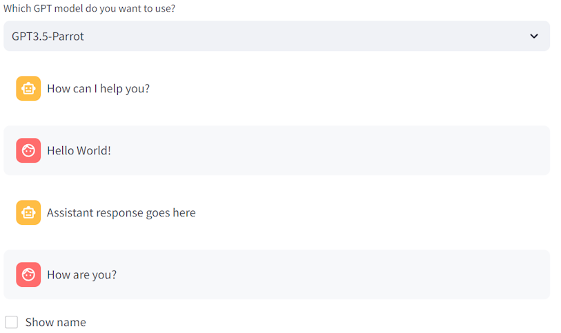

# Super-Intelligent Parrot Chatbot

Original repo: https://github.com/girunlu/neuron.ai-projects.git

This is a simple chatbot application created using Streamlit. The chatbot allows users to interact with it, select a GPT model, input messages, and receive simulated responses.



## How to Run

1. Make sure you have Python installed.

2. Install the required dependencies using:

   ```bash
   pip install streamlit
   ```

## Run the application using the following command:

```bash
streamlit run chatbot_app.py
```

## Usage

- Upon launching the application, you'll be greeted with the Super-Intelligent Parrot Chatbot header.

- Choose a GPT model from the available options in the dropdown menu.

- The chat window displays messages from the assistant, starting with a default greeting.

- You can input messages using the chat input box. The chatbot simulates responses and appends them to the chat window.

- Optionally, check the "Show name" checkbox to input and display your name.

## Customization

Feel free to customize the chatbot behavior, appearance, or add more features based on your requirements. The code is modular and can be extended easily.

# Acknowledgment

Thank you for participating in this demo! For more information and to stay up-to-date with our events, visit [Neuron AI](https://neuron-ai.at/).
